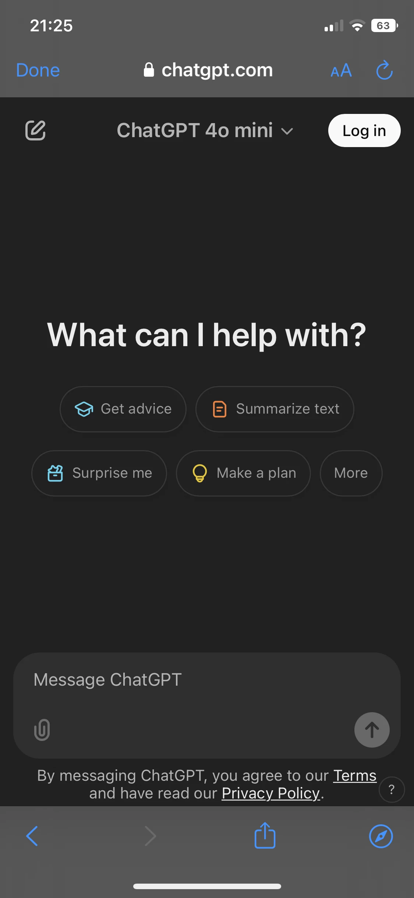

# chatgpt-pwa

This is a simple wrapper for ChatGPT, created to open the ChatGPT page separately from Safari on older iOS versions. While the Safari interface (top and bottom bars) is still present, this allows you to use ChatGPT as a standalone app and keep Safari free for other tasks without losing your ChatGPT tab.

## How to install the PWA:
1. Open [https://ligul.github.io/chatgpt-pwa/](https://ligul.github.io/chatgpt-pwa/) in Safari on your iPhone.  
2. Tap the **Share** button (the square with an arrow).  
3. Select **Add to Home Screen** from the menu.  
4. Open the app from your home screen and enjoy!

## Example Screenshot:

  

